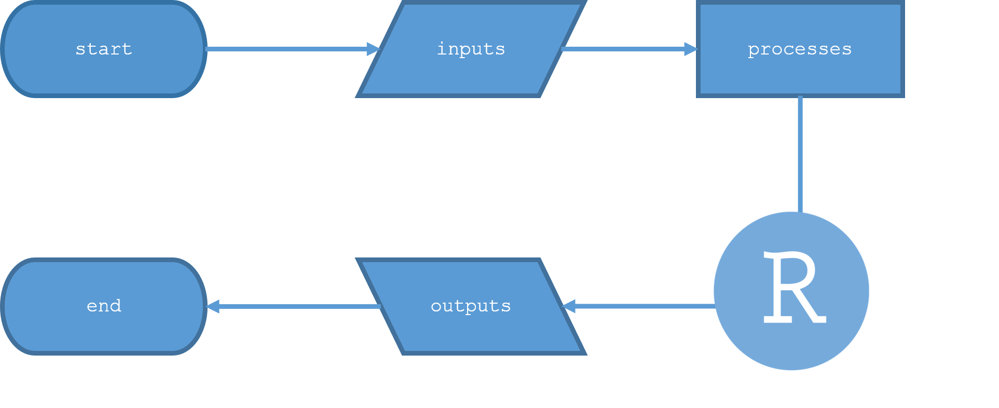

# Introduction and basic knowledge overview

> ### Learning Objectives
>
> * Understand why interactive tools are powerful
> * Understand what pieces are needed for an interactive tool
> * Understand how R shiny puts the pieces together to form an interactive tool

## Importance of interactivity for engagement and understanding

> [Interactive] "tools that can be used to engage stakeholders and help them understand and apply relevant data“ (Carls and Griffin, 2016)

Interactive tools are an engaging way to communicate data and concepts. Users can learn as they are doing how the different pieces fit together and what it means for their individual situation. Many groups in extension and science communication have started to recognize this but interactive tools are not being used in many places where they could be a perfect fit. 

Interactive maps in R shiny are open-source, customizable, and of professional-quality. They allow users to explore data, provide both spatial and non-spatial inputs, and receive personalized feedback.

## Examples of what is possible with interactive maps in R shiny

[The California Weather Web-Tool](https://smallgrain-n-management.plantsciences.ucdavis.edu/weather/) provides location- and time-specific weather information for sites in the state of California.

[The Soil Nitrate Quick Test Web-Tool](https://smallgrain-n-management.plantsciences.ucdavis.edu/snqt/) simplifies the process of interpreting a soil nitrate value so that users only have to select their location and input test results to receive an estimated lab soil nitrate value and an N fertilizer equivalent. Open-source code: https://github.com/Grain-Cropping-Systems-Lab/UC-Small-Grain-Soil-Nitrate-Quick-Test-Tool

[The Nitrogen Fertilizer Management Tool for California Wheat (Beta)](https://smallgrain-n-management.plantsciences.ucdavis.edu/) is an interactive website that provides customized, site-specific nitrogen (N) fertilizer recommendations for California small grain growers. It integrates spatial statewide weather and soil data with user-supplied, field-specific measurements in order to provide real-time N fertilizer recommendations. 

## Need to know shiny basics

R shiny is a platform that is made for building interactive applications. It is customizable and has a robust knowledge base. There are free tutorials online as well as forums where you can ask questions about troubleshooting. It is an open-source platform and based in the R programming language which many people have experience with. 

An R shiny application is has a few basic parts. Inputs, processes, and outputs. Inputs are typically pieces of information collected from the user, processes all happen as R functions or sets of code, and outputs are the results of those processes. When starting a new application a creator must link about each of these piece and ask:

* what inputs will the user provide and be able to change?
* what outputs are needed and how are they going to be presented to the user?
* what processes are needed to take the inputs to the outputs?

A shiny application request two main parts, a ui and server function. The ui function defines what the user sees and [can input](https://shiny.rstudio.com/gallery/widget-gallery.html). It will also show any outputs. 

The server runs the processes and calculates any outputs. It is a function that takes inputs and outputs.

A basic shiny example: https://shiny.rstudio.com/gallery/single-file-shiny-app.html

In a shiny application like in the [The California Weather Web-Tool](https://smallgrain-n-management.plantsciences.ucdavis.edu/weather/), the main input is the location of user defined point. This point is used to run the processes (pulling and summarizing the weather data) that create the outputs (summary values and graphs of the data at that point).

## Resources 

For a full understanding of how shiny applications work and all the different options available to creators there are many good resources.

https://shiny.rstudio.com/tutorial/

https://www.r-bloggers.com/2021/04/the-best-resources-for-learning-shiny-app-development/

## Next steps

Now you are ready to move on to [Create interactive shiny maps with googleway](02-googleway-shiny-maps.md)
